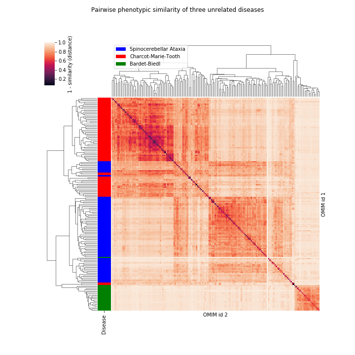

[](https://www.python.org/downloads/release/python-360/)

# Phenosim
`phenosim` is a Python package to perform phenotype similarity scoring by semantic similarity. `phenosim` is a lightweight but highly optimized command line tool and library to efficiently perform semantic similarity scoring on generic entities with phenotype annotations
from the [Human Phenotype Ontology (HPO)](https://hpo.jax.org/app/).



## Installation
### GitHub
Install from GitHub:
```bash
git clone https://github.com/GeneDx/phenosim.git
cd phenosim
python setup.py install
```

## Command Line Usage
`phenosim` will create a `.phenosim/` directory in your home folder and download external resources from HPO into the `.phenosim/data` directory.
`phenosim` is primarily used as a command line tool. An entity, as described here, is presented as a sample, gene, or disease, but could be any concept that warrants annotation of phenotype terms. 

1. Score similarity of an entity defined by the HPO terms from an input file against all the genes in `.phenosim/data/phenotype_to_genes.txt`. We provide a test input file in the repo.
    ```bash
    phenosim score tests/data/test.score.txt
    ```
    Output:
    ```
    query-A2M       0.0
    query-AAGAB     0.0371
    query-A4GALT    0.0025
    ...
    ```

2. Score similarity of an entity defined by the HPO terms from an input file against a custom list of entities with HPO annotations, referred to as the `--records-file`.
    ```bash
    phenosim score tests/data/test.score.txt --records-file tests/data/test.score-product.txt
    ```
    Output:
    ```
    query-001	0.0809
    query-002	0.0813
    query-003	0.0781
    ...
    ```

3. Score pairwise similarity of entities defined in the `--records-file`.
    ```bash
    phenosim score-product tests/data/test.score-product.txt
    ```
    Output:
    ```
    001-001	0.8444
    001-002	0.1097
    001-003	0.1211
    ...
    ```

## Parameters
For a full list of command arguments use `phenosim [subcommand] --help`:
```bash
phenosim score --help
```
Output:
```
    --records_file=RECORDS_FILE
        One record per line, tab delimited. First column record unique identifier, second column pipe separated list of HPO identifier (HP:0000001).
    --query_name=QUERY_NAME
        Unique identifier for the query file.
    --obo_file=OBO_FILE
        OBO file from https://hpo.jax.org/app/download/ontology.
    --pheno2genes_file=PHENO2GENES_FILE
        Phenotypes to genes from https://hpo.jax.org/app/download/annotation.
    --threads=THREADS
        Number of parallel process to use.
    --agg_score=AGG_SCORE
        The aggregation method to use for summarizing the similarity matrix between two term sets Must be one of {'BMA', 'maximum'}
    --no_parents=NO_PARENTS
        If provided, scoring is done by only using the most informative nodes. All parent nodes are removed.
    --hpo_network_file=HPO_NETWORK_FILE
        If provided, phenosim will try to load a cached hpo_network obejct from file.
    --custom_annotations_file=CUSTOM_ANNOTATIONS_FILE
        A comma-separated list of custom annotation files in the same format as tests/data/test.score-product.txt
```  

## Library Usage
The `phenosim` library can be used as a `Python` module, allowing more control for advanced users.   

```python
import os
from phenosim import config
from phenosim.obo import restore
from phenosim.score import Scorer

network_file = os.path.join(config.data_directory, 'hpo_network.pickle')

hpo = restore(network_file)
scorer = Scorer(hpo)

terms_a = ['HP:0001882', 'HP:0011839']
terms_b = ['HP:0001263', 'HP:0000252']

print(scorer.score(terms_a, terms_b))
```
Output:
```
0.0005
```

Another example is to use the library to prune parent phenotypes from the `phenotype_to_genes.txt`
```python
import os
from phenosim import config
from phenosim.obo import restore
from phenosim.util import export_pheno2genes_with_no_parents


network_file = os.path.join(config.data_directory, 'hpo_network.pickle')
phenotype_to_genes_file = os.path.join(config.data_directory, 'phenotype_to_genes.txt')
phenotype_to_genes_no_parents_file = os.path.join(config.data_directory, 'phenotype_to_genes_no_parents.txt')

hpo = restore(network_file)
export_pheno2genes_with_no_parents(phenotype_to_genes_file, phenotype_to_genes_no_parents_file, hpo)
```  

## Contributing
We welcome contributions from the community. Please follow these steps to setup a local development environment.  
```bash
pipenv install --dev
```

To run tests locally:
```bash
pipenv shell
coverage run --source=. -m unittest discover --start-directory tests/
coverage report -m
```  

## References
The underlying algorithm which determines the semantic similarity for any two HPO terms is based on an implementation of HRSS, [published here](https://www.ncbi.nlm.nih.gov/pubmed/23741529).
